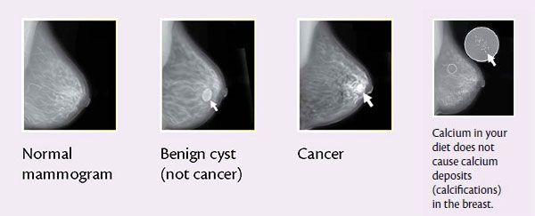

This blog has been talking a lot about Machine Learning (ML) with regard to tabular data. That makes sense because predictive algorithms based on tabular data are often easy to implement and have a lot of potential to improve outcomes. Also, we have access to a lot of tabular data from the EHR.  However, ML is capable of doing a lot more than predicting probabilities on tabular data, and there are incredible opportunities in other areas of healthcare. One in particular is in Radiology and Pathology departments. These departments generate tabular data, but their bread and butter is image data. Beth Israel Deaconess Medical Center (Harvard), for instance, generates approximately 20 terabytes of image data per year (vs. 1 TB text data) [source](http://geekdoctor.blogspot.com/2011/04/cost-of-storing-patient-records.html). That’s a lot of data to potentially use! 

With all the talk around deep learning lately, it would be hard for an ML group to avoid at least discussing whether or not it would be practical to develop our own applications. While deep learning is absolutely a buzz word, there is a lot of potential behind the technique. In only a handful of years, deep learning will [driving our cars](https://www.tesla.com/autopilot), doing [real time translation of spoken language](http://www.nytimes.com/2016/12/14/magazine/the-great-ai-awakening.html?smid=pl-share&_r=0), allowing you to [virtually try on glasses online](https://www.ditto.com/), and many other amazing things that we haven’t even imagined yet. With this kind of limitless potential, it isn’t hard to imagine an opportunity for computers to read medical images, as outlined in this paper from the [New England Journal of Medicine](http://www.nejm.org/doi/full/10.1056/NEJMp1606181).

One of the great things about working on [healthcare.ai](http://www.healthcare.ai) is the opportunity to plan and shape [what the package is capable of](http://healthcare.ai/blog/2016/12/21/which-algorithms-are-in-healthcareai/). There are things that we are working towards in the near future, like unsupervised learning, and there is functionality that is still not mainstream and will require a more concentrated research effort for us to be able to implement. **The purpose of this post is to try to provide a survey of machine learning on medical imaging, and where the lowest hanging fruit might be.**  

One area, [mammographic screening](https://www.cancer.gov/types/breast/mammograms-fact-sheet#q1), is a particularly promising application of deep learning. Women are recommended to get an annual mammogram for the later 30 or 40 years of their lives, the images are consistent, and they take a lot of radiologist time to evaluate. Take a look at [these images](http://ashevillegynecologywellness.com/wp-content/uploads/2016/05/MammoGram-Seriesshow.jpg). Even if you are not a trained radiologist, you are probably able to make medically relevant observations about them. The normal mammogram looks rather indistinct. There are brighter areas and darker areas, but they are mostly linear. The second image from the left has a large, round, and uniformly bright spot, almost a sure sign of a cyst. Finally, the cancer image has a very bright spot that seems to have tentacles extending from a central structure. While real images can be extremely subtle and difficult to read (that’s why you need an MD!), a radiologist would perform the same steps you just did. They make observations about the image, relate their findings to their medical knowledge, and make a diagnosis. 

As it turns out, [deep learning algorithms](http://www.nature.com/nature/journal/v521/n7553/full/nature14539.html) excel at the same kind of analysis and pattern recognition that a radiologist does. The algorithms will examine thousands of images of every type and eventually learn how to distinguish them based on different sized sections of the image. There is potential to see patterns that would elude even best radiologists, detect exquisitely specific changes in a single person’s history, and totally transform radiology. This application could help to treat breast cancer more effectively, at lower cost, with less resources.
Of course, there have already been efforts at individual academic medical centers in mammographic screening. Big breakthroughs in breast imaging are just starting to come out in the high-impact journals. 
-	Recently, [Wang et al.](http://www.nature.com/articles/srep27327) were able to detect [microcalcifications](http://www.mayoclinic.org/symptoms/breast-calcifications/basics/definition/sym-20050834) in mammograms, in effective early indicator of breast cancer. They used a data set of approximately 1200 images to train a Stacked Auto-Encoder deep learning architecture, and were able to identify microcalcifications with an [AUC](http://healthcare.ai/blog/2016/12/15/model-evaluation-using-roc-curves/) of 0.87. 
-	In another study, [Cheng et al.](http://www.nature.com/articles/srep24454) used a Stacked Denoising Auto-Encoder to differentiate malignant breast lesions from benign in 550 [ultrasound](http://www.cancer.org/cancer/breast-cancer/screening-tests-and-early-detection/breast-ultrasound.html) images. They achieved an AUC of 0.90 for the task.
-	Finally, [Levi et al.](https://arxiv.org/abs/1612.00542) trained several existing Convolutional Neural Network (CNN) architectures to classify pre-labeled regions from 1800 mammograms. Their GoogLeNet CNN was able to distinguish malignant from benign with precision of 0.92 and recall of 0.93.

If we were to move forward with a deep learning model for breast imaging, reproducing one of these studies would be a good starting point. Screening mammograms are probably the best place to start, due to their high volume in healthcare. In addition to breast imaging, [this excellent review](http://ieeexplore.ieee.org/stamp/stamp.jsp?arnumber=7463094) points out several other promising areas to begin. Additional promising areas are in lung cancer screening from CT images, and in automated tissue labeling of brain MRI. In lung cancer screening and automatic brain segmentation,
-	[Yang et al.](https://arxiv.org/ftp/arxiv/papers/1611/1611.06651.pdf) employed a CNN to classify known lung nodules as either malignant or benign from 4 separate data sets. Some of their models failed to generalize well, but others could achieve extremely high classification accuracy on the validation set. 
-	In the same paper as their breast study, [Cheng et al.](http://www.nature.com/articles/srep24454) classified 1400 lung nodules from chest CT images. They saw AUC as high as 0.98 depending on the algorithm configuration.
-	[Havaei et al.](http://www.sciencedirect.com/science/article/pii/S1361841516300330) present their state of the art in segmentation of glioblastoma brain tumors from MRI images. They use a CNN to segment a competition data set with practical speed (0.5 to 3 minutes) and high accuracy. 

It would be crazy to try to cover every bit of research in this post. There are countless studies to cover beyond those discussed here, plus annual conferences such as [NIPS](https://nips.cc/) and [ICML](https://2017.icml.cc/). However, it would be worth mentioning a few areas of research from the private sector.
-	Google Deepmind [recently announced a health initiative](https://deepmind.com/applied/deepmind-health/) and has been working to identify diabetic retinopathy from images of the eye. 
-	The San Francisco based start-up, [Enlitic](http://www.enlitic.com/), works to develop deep learning methods for the use cases above and has partnered with several hospitals already.
-	[Siris Medical](http://siris-medical.com/) works to use past patient data to automate radiation treatment planning and brain segmentation. 

Finally, many of the data sets that were used in the studies mentioned above are open source and freely available.  
-	[Visceral](http://www.visceral.eu/)
-	[ImageNet](http://image-net.org/)
-	[Kaggle Data Science Bowl](https://www.kaggle.com/c/data-science-bowl-2017)
-	[Grand Challenge](https://grand-challenge.org/All_Challenges/)
-	[Lung Image Database Consortium](https://imaging.cancer.gov/programsandresources/informationsystems/lidc)
-	[Multimodal Brain Tumor Segmentation Challenge](http://braintumorsegmentation.org/)

Breast screening, lung screening, and brain segmentation are the some of the most popular and promising applications of deep learning in healthcare currently. Early research in these areas has shown encouraging results, and there is a lot of effort towards advancements. Furthermore, these areas have the potential to benefit a lot of patients as they include common diseases, treatments, and procedures. It’s an exciting time to be in healthcare machine learning, and we look forward to implementing deep learning into our package.   Thanks for reading, and please feel free to [reach out](http://healthcare.ai/contact) with questions!
